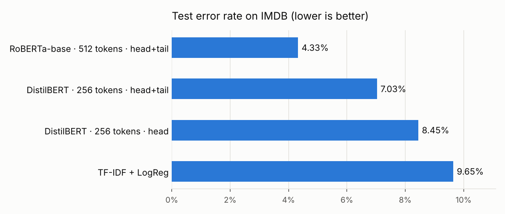
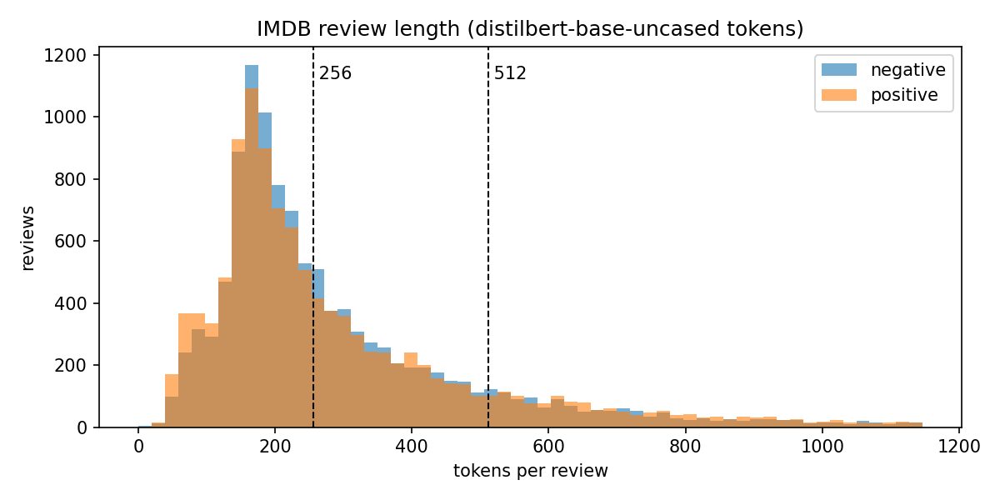
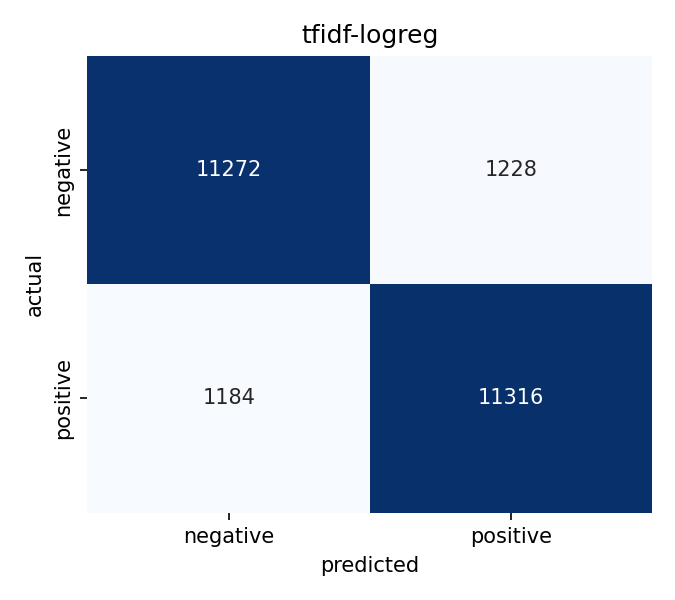
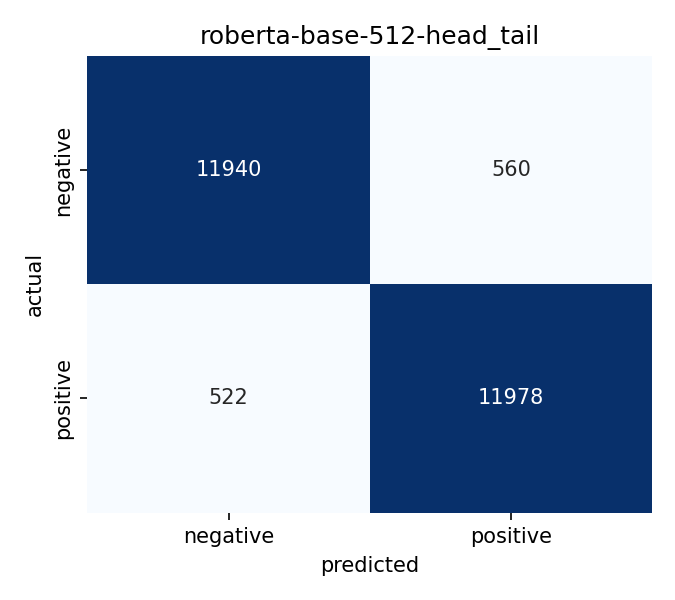

# Movie Review Sentiment Analysis with Transformers

[](https://colab.research.google.com/github/haikalfr04/Sentiment-Analysis/blob/claude/affectionate-heisenberg-tci6z1/notebooks/imdb_sentiment_colab.ipynb)


Binary sentiment classification (positive / negative) of IMDB movie reviews, comparing a classical
TF-IDF baseline with fine-tuned pretrained transformers (DistilBERT, RoBERTa).

**Best model: RoBERTa-base, 95.67% accuracy on the 25,000-review test set, 55% fewer errors than the TF-IDF baseline.**

The project looks past "fine-tune BERT, report accuracy" at three questions:

1. **Is a transformer worth it?** Accuracy against parameter count, training time and inference speed, measured against a well-tuned classical baseline.
2. **Which part of a long review matters?** 41% of reviews are longer than 256 tokens. Keeping only the beginning (*head*) is compared with keeping the beginning and the end (*head+tail*, Sun et al., 2019).
3. **Where does the model still fail?** Analysis of its most confident mistakes.

<!-- Add once deployed: **Demo:** <Hugging Face Spaces link> · **Model:** <Hugging Face Hub link> -->

## Results



| Model | Max tokens | Truncation | Accuracy | F1 | Errors (of 25k) | Params | Train time* | Inference* (reviews/s) |
|---|---|---|---|---|---|---|---|---|
| TF-IDF + LogReg | - | - | 90.35% | 90.37% | 2,412 | 0.2M | 13 s | 6,402 |
| DistilBERT | 256 | head | 91.55% | 91.56% | 2,113 | 67M | 45 s | 3,677 |
| DistilBERT | 256 | head+tail | 92.97% | 92.99% | 1,758 | 67M | 44 s | 3,672 |
| **RoBERTa-base** | **512** | **head+tail** | **95.67%** | **95.68%** | **1,082** | **125M** | **150 s** | **1,210** |

<sub>*Transformers trained for 2 epochs on an NVIDIA RTX PRO 6000 (Blackwell) GPU. TF-IDF trained and evaluated on CPU, time is for one fit. Single run per configuration, seed 42.</sub>

### Key findings

- **Head+tail truncation is a free accuracy gain.** With the same model, token budget and training time, keeping the start *and the end* of long reviews raised DistilBERT from 91.55% to 92.97% accuracy and cut errors by 17% (2,113 → 1,758). Reviewers often state their verdict in the last few sentences, and plain truncation throws exactly that away for the 41% of reviews longer than 256 tokens.
- **A tuned TF-IDF baseline is hard to beat.** At 90.35% it is only 1.2 points behind DistilBERT with naive truncation, while being far smaller and faster. A transformer only pays off clearly when it gets enough context.
- **RoBERTa with 512 tokens is the clear winner.** 95.67% accuracy and 55% fewer errors than TF-IDF, at the cost of nearly 2× the parameters of DistilBERT and 3× slower inference. Its mistakes are balanced (560 false positives, 522 false negatives), so it is not biased toward either class.
- **Many of the remaining "errors" are not model errors.** Among RoBERTa's most confident mistakes (see below), several reviews disagree with their own label or rely on sarcasm, which puts a soft ceiling on achievable accuracy.

### Data: review length



The median review is 222 tokens and the mean 298, with a long tail up to 3,047. 41.3% of training reviews exceed 256 tokens and
13.4% exceed 512. Both classes have nearly identical length distributions, so length alone carries no signal. Stats: [`results/eda_stats.json`](results/eda_stats.json).

### Error analysis

The test reviews RoBERTa got wrong with ~99.9% confidence fall into a few recognizable groups
(full reports in [`results/errors/`](results/errors/)):

| Pattern | Example (shortened) | Label → predicted |
|---|---|---|
| **Sarcasm** | "This has to be one of the all time greatest horror movies … its not hard to see why Band went on to make such classics as 'Killjoy 2: Deliverance From Evil'" | negative → positive |
| **"So bad it's good"** | "it had to be one of the worst movies ever. Funny, in a real bad way." | positive → negative |
| **Mixed review** | "Do I say how great the cinematography is … the film is boring it moves so slow, that watching paint dry would be an improvement." | positive → negative |
| **Text contradicts the label** | "I found 'Strange Fruit' to be an excellent movie … the acting (…) is wonderful, the cinematography and direction excellent" | negative → positive |

IMDB labels come from the reviewer's star rating (≤4 negative, ≥7 positive), not from the text. When the rating and the
words disagree, the model follows the words, which is arguably the correct behavior for a sentiment classifier.

<p align="center">
  
  
</p>

## Approach

**Data.** [`stanfordnlp/imdb`](https://huggingface.co/datasets/stanfordnlp/imdb) has 25k train and 25k test reviews, balanced 50/50.
A stratified 10% of the training set (2,500 reviews) is held out for validation and model selection, so the test set is only
used for the final numbers. `<br />` tags are stripped.

**Baseline.** TF-IDF on word uni- and bigrams (200k features, sublinear TF), plus logistic regression. The regularization
strength is tuned on the validation split (best: C = 4).

**Transformers.** Fine-tuned with the Hugging Face `Trainer`: AdamW, learning rate 2e-5, linear schedule with
10% warmup, 2 epochs, mixed precision. The checkpoint with the best validation F1 is kept.

**Truncation.** With *head+tail*, a review that exceeds the token budget keeps its first 25% and last 75% of
tokens, as recommended by Sun et al. (2019). The setting is saved with the model (`inference_config.json`) so
prediction tokenizes the same way as training.

## Limitations and next steps

- The RoBERTa run changes both the model and the context length, so its gain over DistilBERT can't be split between the two. A RoBERTa 512 *head* run would isolate the truncation effect at 512 tokens.
- Each configuration was trained once. Repeating with several seeds would give confidence intervals for the smaller gaps.
- Explainability (e.g. SHAP or integrated gradients) would show which words drive the sarcasm and "so bad it's good" mistakes.
- Distilling RoBERTa into DistilBERT could recover part of the accuracy at DistilBERT's speed.

## Project structure

```
├── src/
│   ├── data.py        # loading, cleaning, head/head+tail truncation, tokenization
│   ├── eda.py         # class balance, review length distribution
│   ├── baseline.py    # TF-IDF + Logistic Regression
│   ├── train.py       # transformer fine-tuning (any Hugging Face model)
│   ├── evaluate.py    # comparison table and chart, confusion matrices, error reports
│   ├── predict.py     # inference CLI / SentimentPredictor class
│   └── metrics.py     # shared metrics and result files
├── app/app.py         # Gradio demo
├── notebooks/imdb_sentiment_colab.ipynb   # runs the whole pipeline on Colab
├── tests/             # unit tests for cleaning and truncation
└── results/           # metrics JSON, figures, error reports
```

## Quickstart

The easiest way is the **Open in Colab** button above: select a GPU runtime, then **Runtime → Run all**. Locally:

```bash
pip install -r requirements.txt

python -m src.eda                                   # data analysis
python -m src.baseline                              # TF-IDF baseline
python -m src.train --model_name distilbert-base-uncased --max_length 256 --truncation head
python -m src.train --model_name distilbert-base-uncased --max_length 256 --truncation head_tail
python -m src.train --model_name roberta-base --max_length 512 --truncation head_tail --batch_size 8 --grad_accum 2
python -m src.evaluate                              # comparison table + error analysis

python -m src.predict --model_dir models/roberta-base-512-head_tail "What a fantastic film!"
MODEL_DIR=models/roberta-base-512-head_tail python app/app.py
```

For a quick check that everything runs, add `--max_train_samples 500 --max_eval_samples 200 --epochs 1`.
`python -m src.train --help` lists every option, including `--report_to wandb` for experiment tracking and
`--hub_model_id` to push the model to the Hugging Face Hub.

Run the tests with `pytest`.

## Deploying the demo

1. Push the trained model to the Hub (last section of the notebook, or `--hub_model_id`).
2. Create a Gradio Space on Hugging Face and upload `app/app.py` as `app.py`, along with the `src/` folder and `requirements.txt`.
3. In the Space settings, set the `MODEL_DIR` variable to your Hub repo id, for example `username/imdb-sentiment-roberta`.

## References

- Devlin et al., 2019. *BERT: Pre-training of Deep Bidirectional Transformers for Language Understanding.*
- Liu et al., 2019. *RoBERTa: A Robustly Optimized BERT Pretraining Approach.*
- Sanh et al., 2019. *DistilBERT, a distilled version of BERT.*
- Sun et al., 2019. *How to Fine-Tune BERT for Text Classification?*
- Maas et al., 2011. *Learning Word Vectors for Sentiment Analysis* (IMDB dataset).
